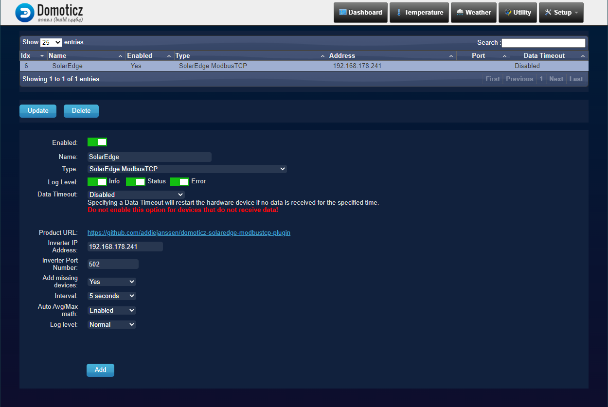
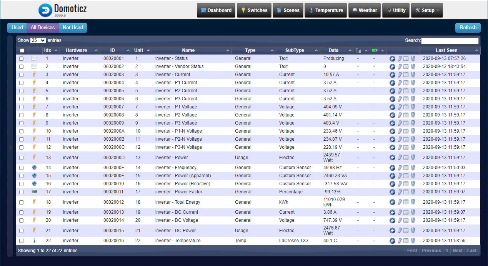
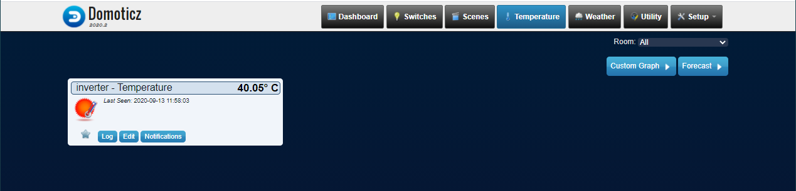
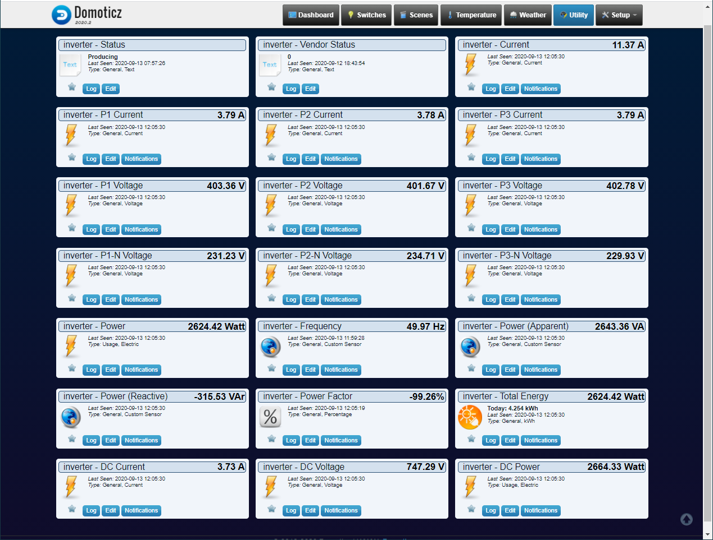

# Domoticz SolarEdge_ModbusTCP plugin

A Domoticz plugin to collect data from SolarEdge power inverters over ModbusTCP.

The plugin uses the `solaredge_modbus` library (<https://github.com/nmakel/solaredge_modbus>) to communicate with the inverter.

## Requirements

The inverter needs to be connected to the network (either wired or wireless) and Modbus must be enabled on the device. Please consult the documentation of your inverter to find out how to enable Modbus.

## Installation of the plugin

This guide is based on Ubuntu 20.04 LTS:

Install `pip3`:

``` shell
sudo apt install python3-pip
```

Install `domoticz`:

``` shell
curl -sSL install.domoticz.com | sudo bash
```

Make sure that the `plugins` folder exists in the `domoticz` folder.

Install the plugin:

``` shell
cd domoticz/plugins
git clone https://github.com/addiejanssen/domoticz-solaredge-modbustcp-plugin.git
```

Go to the plugin folder and install all required addons:

``` shell
cd domoticz/plugins/domoticz-solaredge-modbustcp-plugin
sudo pip3 install -r requirements.txt
```

Once that is done, restart domoticz:

``` shell
sudo service domoticz.sh restart
```

## Configuration in Domoticz

Once the plugin is installed, a new hardware type will be available: `SolarEdge ModbusTCP`.

To add the inverter, go to `Setup` -> `Hardware` and add the inverter:

- Enter a `name` for the inverter.
- Select `SolarEdge ModbusTCP` from the `type` dropdown list.
- Enter the IP address of the inverter in the `Inverter IP Address` field.
- Enter the port number (default: 502) of the inverter in the `Inverter Port Number` field.
- Select `Yes` in the `Add missing devices` to create the devices when the inverter is added. Select `No` after deleting unwanted devices. Leaving the option set to `Yes` will recreate the deleted devices once Domoticz is restarted.
- Select an `Interval` (default: 5 seconds); this defines how often the plugin will collect the data from the inverter. Short intervals will result in more accurate values and graphs, but also result in more network traffic and a higher workload for both Domoticz and the inverter.
- Optionally change the `Log level`; this defaults to `Normal`. When selecting `Extra`, the plugin will print all the information it received from the inverter in the log.
- Optionally turn on `Debug`; be aware: this will generate a lot of entries in the Domoticz log!
- `Add` the inverter.

This should result in a lot of new devices in the `Setup` -> `Devices` menu.

## Updating the plugin

Go to the plugin folder and get the new verion:

``` shell
cd domoticz/plugins/domoticz-solaredge-modbustcp-plugin
git pull
```

Once that is done, restart domoticz:

``` shell
sudo service domoticz.sh restart
```

## Example

Here's an example of information returned by an inverter (in this case a SE7000 3 phase inverter):

| Name              | Value                 | Symbol |
|-------------------|-----------------------|--------|
| Model             | SE7K                  |        |
| Version           | 0003.2251             |        |
| Serial            | 7E2AB053              |        |
| Modbus ID         | 1                     |        |
| SunSpec DID       | Three Phase Inverter  |        |
| Status            | Producing             |        |
| Vendor Status     | 0                     |        |
| Current           | 3.59                  |    A   |
| P1 Current        | 1.21                  |    A   |
| P2 Current        | 1.17                  |    A   |
| P3 Current        | 1.20                  |    A   |
| P1 Voltage        | 401.4                 |    V   |
| P2 Voltage        | 401.2                 |    V   |
| P3 Voltage        | 402.8                 |    V   |
| P1-N Voltage      | 230.1                 |    V   |
| P2-N Voltage      | 232.7                 |    V   |
| P3-N Voltage      | 230.4                 |    V   |
| Power             | 784.0                 |    W   |
| Frequency         | 50.01                 |   Hz   |
| Power (Apparent)  | 829.1                 |   VA   |
| Power (Reactive)  | -270.00               |  VAr   |
| Power Factor      | -94.46                |    %   |
| Total Energy      | 10773388              |   Wh   |
| DC Current        | 1.0647                |    A   |
| DC Voltage        | 747.5                 |    V   |
| DC Power          | 795.9                 |    W   |
| Temperature       | 43.53                 |   °C   |

## Screenshots

Hardware page showing a configured inverter.



The devices page shows all Domotics devices that were created for the inverter.



The Domoticz Temperature page shows the inverters temperature data.



All the other information is visible in the Domoticz Utility page.


